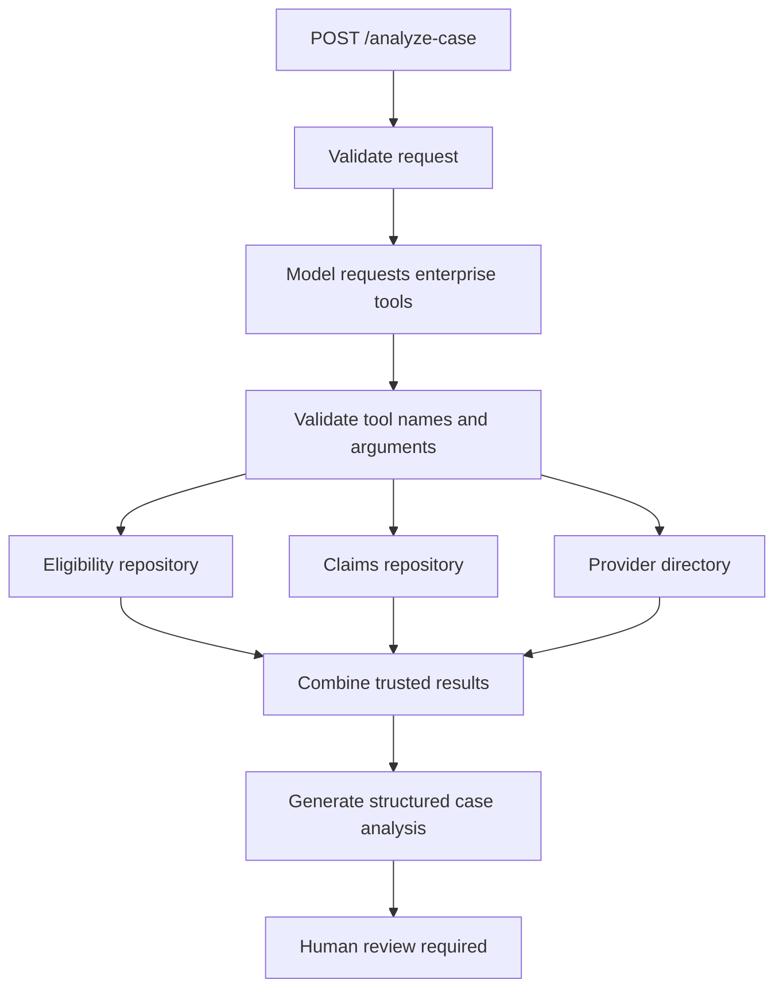

# Healthcare Prior Authorization Copilot

An AI-assisted healthcare application that analyzes synthetic prior-authorization
cases, retrieves applicable coverage policies, detects missing documentation,
and prepares an evidence-based recommendation for human review.

## Planned Capabilities

- Retrieval-augmented generation with policy citations
- LLM tool calling for healthcare enterprise services
- Structured and validated AI responses
- Human approval for consequential actions
- Synthetic FHIR-based healthcare data
- Automated LLM evaluations
- Java and Python service integration
- Containerized AWS deployment
- Audit logging, security and observability

## Important Notice

This is a portfolio demonstration using synthetic data. It is not a medical
device, does not provide medical advice, and does not make autonomous coverage
decisions.

## Portfolio Evidence Checklist

- [ ] FastAPI AI orchestration service
- [ ] Spring Boot enterprise integration API
- [ ] PostgreSQL and vector retrieval
- [ ] Versioned prompt templates
- [ ] Structured and schema-validated LLM responses
- [ ] Member eligibility tool
- [ ] Claim history tool
- [ ] Provider information tool
- [ ] Healthcare policy retrieval with citations
- [ ] Synthetic FHIR-based case data
- [ ] Human approval workflow
- [ ] Prompt-injection defenses
- [ ] PHI masking demonstration
- [ ] Automated evaluation dataset
- [ ] Accuracy, latency and cost measurements
- [ ] Timeouts, retries and fallback handling
- [ ] Authentication and authorization
- [ ] Audit logging
- [ ] Docker Compose environment
- [ ] CI/CD pipeline
- [ ] AWS deployment
- [ ] Architecture document
- [ ] Production runbook
- [ ] Five-minute client demonstration


### Portfolio summary

Built a healthcare prior-authorization case-preparation API using Python, FastAPI, Pydantic and OpenAI function calling. The service orchestrates three synthetic enterprise integrations for member eligibility, claim history and provider-directory information. Deterministic application code validates generated arguments, restricts execution to allowlisted tools, verifies workflow completeness and preserves result provenance. The final schema-validated analysis identifies available and missing information without making autonomous authorization decisions.

## Day 7 — Multiple Enterprise Tool Integration

The service now integrates three synthetic healthcare enterprise systems through OpenAI function calling:

1. Member eligibility system
2. Claims-history system
3. Provider-directory system

The language model identifies the required function calls, but the Python application validates the generated arguments, executes only allowlisted functions, and returns trusted results to the model for final structured case preparation.

### Enterprise tools

| Tool | Enterprise system represented | Input | Trusted output |
|---|---|---|---|
| `check_member_eligibility` | Membership and enrollment system | `member_id` | Coverage status, plan and coverage dates |
| `get_claim_history` | Claims-processing platform | `member_id` | Previous synthetic claim records |
| `get_provider_information` | Provider directory | `provider_id` | Provider specialty, active status and network status |

All repositories contain synthetic data only. No real protected health information is used.

### Workflow



### Application responsibilities

The application—not the language model—controls enterprise operations.

The service:

- Maintains an allowlist of supported tools.
- Validates tool arguments using Pydantic.
- Rejects unknown tool names.
- Executes deterministic Python functions.
- Verifies that all three required tools were called.
- Rejects missing or duplicate tool calls.
- Preserves source information for every enterprise result.
- Records tool execution details for auditability.
- Validates the final response against a strict schema.
- Prevents the model from approving or denying authorization.

### Request example

```json
{
  "case_id": "PA-7001",
  "member_id": "M-1001",
  "provider_id": "P-2001",
  "requested_service": "Lumbar spine MRI",
  "clinical_information": "Patient reports lower-back pain. Symptom duration and response to prior conservative treatment were not provided."
}
```

### Response example

```json
{
  "request_id": "resp_example",
  "model": "gpt-5.6-luna",
  "latency_ms": 3812,
  "usage": {
    "input_tokens": 735,
    "output_tokens": 284,
    "total_tokens": 1019
  },
  "eligibility_verification": {
    "member_id": "M-1001",
    "status": "active",
    "plan_name": "ClearHealth Gold",
    "coverage_start_date": "2026-01-01",
    "coverage_end_date": null,
    "source": "synthetic_member_repository",
    "checked_at": "2026-10-04T18:00:00+00:00"
  },
  "claim_history": {
    "member_id": "M-1001",
    "claims": [
      {
        "claim_id": "CLM-9001",
        "service_date": "2026-07-10",
        "service_type": "Primary care visit",
        "diagnosis_code": "M54.50",
        "procedure_code": "99213",
        "status": "paid"
      },
      {
        "claim_id": "CLM-9002",
        "service_date": "2026-08-02",
        "service_type": "Physical therapy",
        "diagnosis_code": "M54.50",
        "procedure_code": "97110",
        "status": "paid"
      }
    ],
    "total_claims": 2,
    "source": "synthetic_claims_repository",
    "checked_at": "2026-10-04T18:00:00+00:00"
  },
  "provider_information": {
    "provider_id": "P-2001",
    "provider_name": "Northwest Orthopedic Clinic",
    "specialty": "Orthopedic Surgery",
    "network_status": "in_network",
    "active": true,
    "source": "synthetic_provider_directory",
    "checked_at": "2026-10-04T18:00:00+00:00"
  },
  "tool_executions": [
    {
      "tool_name": "check_member_eligibility",
      "call_id": "call_example_1",
      "status": "succeeded",
      "duration_ms": 1
    },
    {
      "tool_name": "get_claim_history",
      "call_id": "call_example_2",
      "status": "succeeded",
      "duration_ms": 1
    },
    {
      "tool_name": "get_provider_information",
      "call_id": "call_example_3",
      "status": "succeeded",
      "duration_ms": 1
    }
  ],
  "analysis": {
    "case_summary": "The case concerns a lumbar spine MRI request for an eligible member submitted by an active in-network provider.",
    "known_facts": [
      "The member has active coverage.",
      "The provider is active and in network.",
      "The claims repository contains prior primary-care and physical-therapy claims."
    ],
    "missing_information": [
      "Duration and progression of symptoms",
      "Clinical response to conservative treatment",
      "Relevant physical and neurological examination findings"
    ],
    "case_preparation_sufficiency": "unclear",
    "recommended_next_action": "route_to_human_review",
    "authorization_decision": "not_determined",
    "human_review_required": true,
    "limitations": [
      "Claim records do not prove treatment completion or clinical response.",
      "Eligibility and network status do not establish medical necessity."
    ],
    "warnings": []
  }
}
```

Response values such as request IDs, timestamps, latency and token usage will vary between executions.

### Run the service

Install the dependencies:

```bash
pip install -r requirements.txt
```

Create a `.env` file:

```env
OPENAI_API_KEY=your-api-key
OPENAI_MODEL=gpt-5.6-luna
```

Never commit the `.env` file or API key.

Start the FastAPI application:

```bash
uvicorn app.main:app --reload
```

Open the interactive API documentation:

```text
http://localhost:8000/docs
```

Check service health:

```bash
curl http://localhost:8000/health
```

### Test the three-tool workflow

```bash
curl -s \
  -X POST http://localhost:8000/analyze-case \
  -H "Content-Type: application/json" \
  --data @requests/day7-three-tools.json | jq
```

A successful response should contain:

- One eligibility result
- One claim-history result
- One provider-information result
- Three successful tool-execution records
- One schema-validated case analysis
- `authorization_decision` set to `not_determined`
- `human_review_required` set to `true`

### Safety boundaries

This project is a case-preparation assistant, not an autonomous medical-necessity or authorization system.

The following boundaries are enforced:

- Eligibility confirms coverage status only.
- Active eligibility does not establish medical necessity.
- Claims show that billing records exist but do not prove treatment completion, duration, effectiveness or clinical response.
- Provider network status does not establish medical necessity.
- Case text is treated as untrusted data.
- Trusted tool results override conflicting claims in submitted clinical text.
- Unsupported tool names are rejected.
- Tool arguments are validated before execution.
- Missing enterprise records do not result in fabricated information.
- Authorization remains `not_determined`.
- Human review remains mandatory.

### Failure handling

The API returns a controlled error when:

- The model does not request an enterprise tool.
- One or more required tools are missing.
- A required tool is requested more than once.
- The model requests an unsupported tool.
- Tool arguments contain invalid or missing values.
- A tool result cannot be serialized.
- The final response fails schema validation.
- The model does not return structured analysis.

### Project structure

```text
ai-service/
├── app/
│   ├── __init__.py
│   ├── main.py
│   ├── prompts.py
│   ├── schemas.py
│   ├── tools.py
│   ├── eligibility.py
│   ├── claims.py
│   └── providers.py
├── requests/
│   ├── day7-three-tools.json
│   ├── day7-conflict.json
│   └── day7-not-found.json
├── docs/
│   └── day7-multiple-tools-results.md
├── tests/
├── .env.example
├── .gitignore
├── requirements.txt
└── README.md
```

### Day 7 test scenarios

| Scenario | Expected eligibility | Expected claims | Expected provider result | Expected workflow |
|---|---|---:|---|---|
| Normal case | Active | Two claims | Active and in network | Continue case preparation |
| Conflicting case text | Inactive | No claims | Out of network | Trust enterprise tools |
| Missing records | Not found | Empty list | Not found | Request follow-up |
| Unknown tool | Not applicable | Not applicable | Not applicable | Reject execution |
| Invalid arguments | Not applicable | Not applicable | Not applicable | Reject execution |

These are basic integration checks. The formal prompt-injection suite will be added on Day 12, and the full evaluation dataset and runner will be built on Days 14 and 15.

### Day 7 accomplishments

- Expanded the workflow from one integration to three enterprise tools.
- Added synthetic eligibility, claims and provider repositories.
- Implemented model-directed function calling.
- Added Pydantic validation for generated tool arguments.
- Added an explicit tool allowlist and dispatcher.
- Enforced completion of all required enterprise lookups.
- Added source provenance and tool-execution records.
- Separated eligibility, claims and network status from medical necessity.
- Preserved mandatory human review.
- Used synthetic healthcare data throughout the implementation.


## Synthetic Policy Knowledge Base

The project includes 10 versioned synthetic healthcare policies covering
diagnostic imaging, rehabilitation, durable medical equipment, home
health, inpatient admissions, specialty pharmacy and gastroenterology.

Each policy includes:

- Stable policy and section identifiers
- Document and dataset versions
- Effective-date metadata
- Search keywords
- Coverage-preparation criteria
- Required documentation
- Limitations and exceptions
- A mandatory human-review boundary

The dataset contains no real payer policies or protected health
information.

Validate the dataset with:

```bash
python scripts/validate_policy_dataset.py


## Policy Vector Index

The 10-policy synthetic dataset is converted into approximately 50
section-level chunks and embedded using `text-embedding-3-small`.

The local index stores:

- L2-normalized vectors in NumPy format
- Source metadata in JSON Lines format
- Dataset and model provenance in an index manifest
- SHA-256 checksums for integrity validation

Build the index:

```bash
python scripts/build_policy_index.py


## Policy Retrieval API

The service exposes semantic retrieval over the versioned synthetic
healthcare-policy index.

### Endpoint

`POST /retrieve-policies`

### Example

```bash
curl -s \
  -X POST http://localhost:8000/retrieve-policies \
  -H "Content-Type: application/json" \
  -d '{
    "query": "documentation required for lumbar spine MRI",
    "top_k": 3,
    "service_category": "advanced-diagnostic-imaging"
  }' | jq